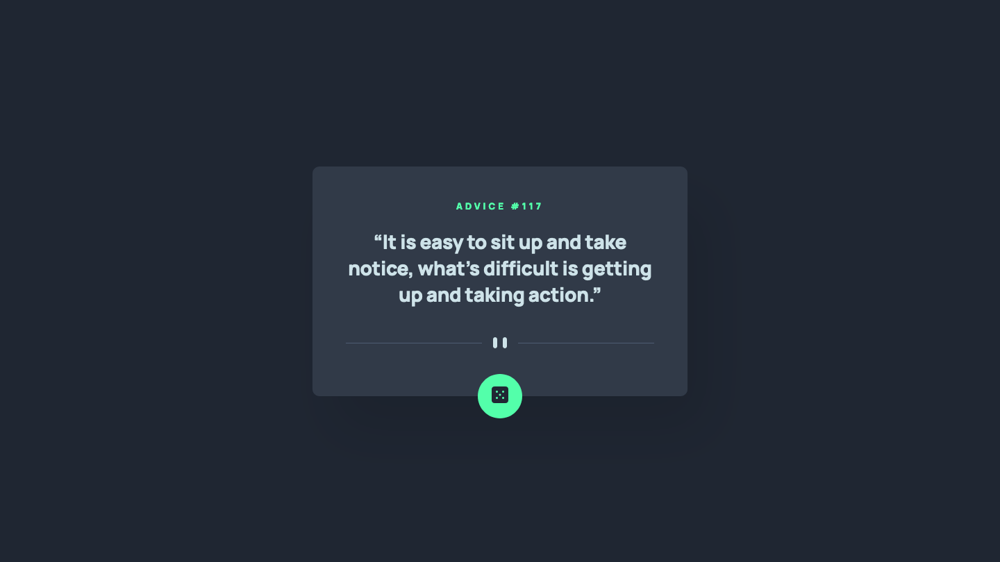

# Advice generator app solution

A solution to the [Frontend Mentor Advice Generator challenge](https://www.frontendmentor.io/challenges/advice-generator-app-QdUG-13db) that creates an interactive app displaying random pieces of advice using the Advice Slip API.

| [Live Demo URL](https://ionstici.github.io/advice-generator-app) | [Frontend Mentor](https://www.frontendmentor.io/solutions/advice-generator-app-HQt2F704VU) |
| ---------------------------------------------------------------- | ------------------------------------------------------------------------------------------ |

## Tech Stack

-   HTML5, CSS3, JavaScript, Advice Slip API, Live-server, Mobile-first approach

## Features

-   Random advice generation with dice button

## Getting Started

```bash
git clone https://github.com/ionStici/advice-generator-app.git
cd advice-generator-app
live-server
# Visit http://localhost:8080 in your browser
```

## Preview



<!-- ### Primary

-   Light Cyan: hsl(193, 38%, 86%)
-   Neon Green: hsl(150, 100%, 66%)

### Neutral

-   Grayish Blue: hsl(217, 19%, 38%)
-   Dark Grayish Blue: hsl(217, 19%, 24%)
-   Dark Blue: hsl(218, 23%, 16%)

### Body Copy

-   Font size (quote): 28px

### Font

-   Family: [Manrope](https://fonts.google.com/specimen/Manrope)
-   Weights: 800 -->
